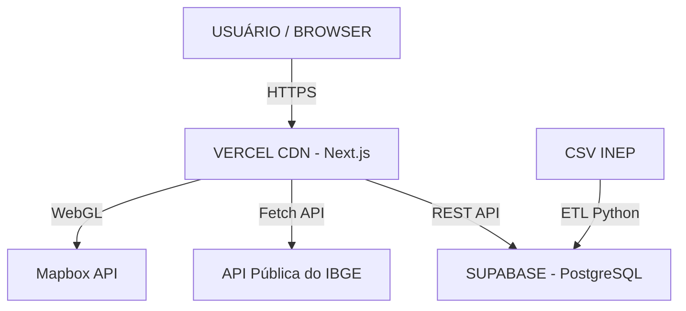

# 🚀 EduVita: PRD — Product Requirements Document
**Plataforma Inteligente de Bem-Estar Escolar | MVP v1.0 — Lean Startup Edition**

> [!CAUTION]
> **CONFIDENCIAL – USO INTERNO EXCLUSIVO**
> Equipe EduVita — Produto & Tecnologia

---

## 📑 Controle de Documento

| Atributo | Detalhe |
| :--- | :--- |
| **Versão** | 1.1 — MVP Entregue (Avaliação A07) |
| **Data** | Maio / 2026 |
| **Status** | 🟢 Concluído e em Produção |
| **Responsável** | Equipe EduVita — Produto |

---

## 1. Visão Geral do Produto

### 1.1 O Que é a EduVita
A EduVita é uma plataforma web analítica que transforma microdados brutos do Censo Escolar (INEP) em inteligência territorial acionável sobre saúde e bem-estar nas escolas públicas brasileiras. A plataforma entrega dashboards executivos, rankings, mapas interativos em 3D e um sistema de ouvidoria pública.

### 1.2 Hipótese Principal do MVP (Validada)
> "Gestores públicos, pesquisadores e profissionais de educação reconhecerão valor imediato ao visualizar indicadores de saúde e bem-estar das escolas de forma clara, com suporte a denúncias públicas e mapas de vulnerabilidade, superando a barreira técnica dos dados brutos."

---

## 2. Escopo Entregue no MVP (Over-delivery)

Superamos as expectativas iniciais do MVP entregando funcionalidades complexas em tempo recorde:

| Módulo | Status | Descrição do Escopo Entregue |
| :---: | :---: | :--- |
| **01 Dashboard** | ✅ | Visão agregada nacional com KPIs e gráficos (`Chart.js`) comparando vulnerabilidade. Integração em tempo real com API Pública do IBGE. |
| **02 Mapas 3D** | ✅ | Integração com `Mapbox GL` para visualização geoespacial das escolas críticas. (Escopo P2 antecipado). |
| **03 Ouvidoria (CRUD)** | ✅ | Sistema completo de Gestão de Denúncias conectado ao Supabase. Permite Criar, Ler, Atualizar e Deletar (CRUD) alertas públicos sobre a infraestrutura escolar. |
| **04 Conformidade Legal** | ✅ | Algoritmo de auditoria automática que verifica se a escola cumpre leis federais (ex: Lei da Água Potável, Psicólogos na Escola). |
| **05 Perfil da Escola** | ✅ | Gaveta lateral interativa exibindo todos os indicadores de saúde e infraestrutura detalhados da escola selecionada. |
| **06 Rankings** | ✅ | Leaderboards identificando as piores escolas e municípios usando a metodologia IVEB. |

---

## 3. Arquitetura Técnica Implementada

A arquitetura foi desenhada para maximizar a velocidade, escalabilidade e design premium:



| Camada | Tecnologia Utilizada | Justificativa |
| :--- | :--- | :--- |
| **Frontend Framework** | Next.js (App Router) + React | Renderização rápida, SEO, e estrutura Feature-First. |
| **Estilização & UI** | TailwindCSS + Lucide Icons | Design System moderno, responsivo (Mobile-First) e ágil. |
| **Gráficos & Mapas** | Chart.js + Mapbox GL | Atendimento aos requisitos da disciplina com visualização de alto impacto. |
| **Backend / BaaS** | Supabase (PostgREST) | Auto-gera API REST para leitura de escolas e operações CRUD de Denúncias. |
| **Banco de Dados** | PostgreSQL | Armazenamento estruturado de escolas, municípios e tabela de `denuncias`. |
| **Deploy** | Vercel | CI/CD nativo e hospedagem ultra-rápida na Edge Network. |

---

## 4. Banco de Dados & Estratégia ETL

### 4.1 Schema Mínimo (PostgreSQL no Supabase)

O banco de dados foi modelado para suportar buscas rápidas e o sistema de Ouvidoria:

```sql
-- Dados Governamentais (Somente Leitura)
TABLE uf (co_uf, sg_uf, no_uf);
TABLE municipio (co_municipio, no_municipio, co_uf);
TABLE entidade (co_entidade, no_entidade, co_municipio, ...infraestrutura);

-- Sistema de Ouvidoria (CRUD Ativo)
TABLE denuncias (
  id uuid PK,
  co_entidade bigint,
  no_entidade text,
  descricao text,
  status text,
  created_at timestamp
);
```

### 4.2 Pipeline ETL
1. Download do CSV do Censo Escolar INEP.
2. Script Python processa os microdados, calcula o índice IVEB localmente e faz o upload em batch para o Supabase, contornando limitações de processamento na nuvem gratuita.

---

## 5. Metodologia do Produto (IVEB)

O **Índice de Vulnerabilidade Escolar do Brasil (IVEB)** é a métrica central do produto, desenvolvida para traduzir os dados brutos do INEP em um indicador único de fácil interpretação.

- **Escala:** A nota vai de 0 (Zero Vulnerabilidade) a 10 (Vulnerabilidade Extrema). Quanto menor a nota, melhor.
- **Avaliação Individual:** O sistema avalia cada escola da rede municipal, atribuindo pontos de penalidade pela ausência de recursos críticos:
  - `+4 pontos`: ausência de banheiro acessível (PNE)
  - `+3 pontos`: ausência de cozinha
  - `+3 pontos`: ausência de refeitório adequado
- **Classificação:** Quando a soma de penalidades de uma escola atinge ou ultrapassa **4 pontos**, ela é classificada como **Escola Crítica**.
- **Cálculo Municipal:** O IVEB final do município é calculado pela proporção de Escolas Críticas em relação ao total de escolas da rede, multiplicada por 10. *(Exemplo: se 50% das escolas de uma cidade são críticas, o IVEB será 5.0)*.

Todos os dados que alimentam este cálculo são públicos (Microdados do INEP).

---

## 6. Pós-MVP — Visão Futura (Próximos Passos)

Com a entrega da Avaliação A07 garantida e a infraestrutura básica totalmente funcional, os próximos passos são:
1. **Autenticação:** Implementar login de usuários via Supabase Auth para que apenas usuários verificados possam criar denúncias.
2. **Dashboard do Gestor:** Criar uma área restrita para Prefeitos e Secretários responderem ativamente às denúncias.
3. **IA Generativa:** Usar IA para analisar e categorizar os textos das denúncias automaticamente.

---
*Documento atualizado ao final da Sprint de Lançamento (Avaliação A07). Equipe EduVita.*
