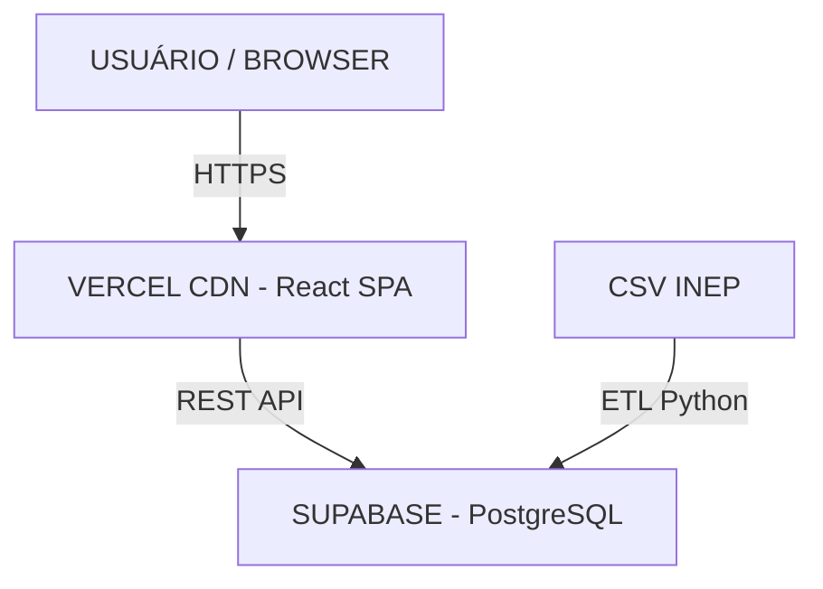

# 🚀 EduVita: PRD — Product Requirements Document
**Plataforma Inteligente de Bem-Estar Escolar | MVP v1.0 — Lean Startup Edition**

> [!CAUTION]
> **CONFIDENCIAL – USO INTERNO EXCLUSIVO**
> Equipe EduVita — Produto & Tecnologia

---

## 📑 Controle de Documento

| Atributo | Detalhe |
| :--- | :--- |
| **Versão** | 1.0 — MVP |
| **Data** | Maio / 2026 |
| **Status** | 🟡 Em Desenvolvimento |
| **Horizonte** | 2 Dias |
| **Responsável** | Equipe EduVita — Produto |

---

## 1. Visão Geral do Produto

### 1.1 O Que é a EduVita
A EduVita é uma plataforma web analítica que transforma microdados brutos do Censo Escolar (INEP) em inteligência territorial acionável sobre saúde e bem-estar nas escolas públicas brasileiras. A plataforma entrega dashboards executivos, rankings e indicadores de infraestrutura escolar — acessíveis a gestores, pesquisadores e cidadãos — sem exigir conhecimento técnico de análise de dados.

### 1.2 Qual Problema Resolve
O Brasil produz um dos maiores conjuntos de microdados educacionais do mundo, mas esses dados permanecem represados em arquivos brutos. Como consequência direta:
- Gestores municipais tomam decisões sem visibilidade territorial clara;
- Diretores escolares não têm ferramentas para justificar pedidos de recursos;
- Pesquisadores desperdiçam semanas higienizando dados;
- Famílias desconhecem as condições reais das escolas.

### 1.3 Para Quem Resolve

| Perfil | Necessidade Principal | Ganho com a EduVita |
| :--- | :--- | :--- |
| 🧑‍💼 **Gestores Públicos** | Diagnóstico territorial p/ recursos | Dashboard pronto com rankings e alertas |
| 🏛️ **Secretarias** | Evidências p/ financiamento | Relatórios fundamentados p/ FNDE e Fundeb |
| 🔬 **Pesquisadores** | Dados higienizados para análise | Acesso imediato a indicadores comparáveis |
| 📰 **Jornalistas/ONGs**| Transparência escolar | Busca por escola e visualizações prontas |

### 1.4 Hipótese Principal do MVP
> "Gestores públicos, pesquisadores e profissionais de educação reconhecerão valor imediato ao visualizar indicadores de saúde e bem-estar das escolas de forma clara, filtrada e comparável — mesmo em um MVP sem autenticação ou funcionalidades avançadas."

---

## 2. Objetivo do MVP

### 2.1 Objetivo Principal
Entregar em **2 dias** uma aplicação web funcional, estável e apresentável que demonstre o valor analítico da EduVita por meio de dados reais do Censo Escolar — validando interesse, utilidade e experiência do usuário antes de qualquer investimento significativo.

### 2.2 O Que Precisa Funcionar Obrigatoriamente
- Dashboard inicial com visão agregada nacional/estadual
- Busca de escolas por nome, município e estado
- Filtros básicos por UF, município e tipo de escola
- Visualização de indicadores de infraestrutura e bem-estar
- Página de detalhes da escola com conjunto mínimo de métricas
- Rankings simples
- Base de dados com dados reais do INEP

### 2.3 O Que NÃO Será Feito Agora — e Por Quê

| Exclusão | Justificativa Estratégica |
| :--- | :--- |
| **Autenticação/Login** | Adiciona fricção. O MVP é público para testes ágeis. |
| **IA Avançada / ML** | Validar primeiro o interesse nos dados e indicadores básicos. |
| **Sistema Multiusuário** | Desnecessário para validação. Aumenta complexidade backend em 10x. |
| **Mapas Georreferenciados** | Alta complexidade. Validar proposta analítica simples primeiro. |
| **Exportação PDF/CSV** | Feature pós-validação de conversão. |

---

## 3. Escopo Mínimo Viável

| Módulo | Descrição do Escopo |
| :---: | :--- |
| **01** | **Dashboard Inicial**: Visão agregada com cards de métricas (escolas, água, saneamento, etc). |
| **02** | **Busca de Escolas**: Campo de busca com retorno instantâneo. |
| **03** | **Filtros Básicos**: Filtros encadeados por UF, Município e Rede. |
| **04** | **Visão de Indicadores**: Cards e gráficos básicos. |
| **05** | **Perfil da Escola**: Página de detalhes exibindo todos os indicadores de saúde e infra. |
| **06** | **Rankings Simples**: Leaderboards com as melhores e piores escolas/municípios por indicador. |

---

## 4. Funcionalidades do MVP (Backlog)

| Funcionalidade | Prioridade | Complexidade | Dependências |
| :--- | :---: | :---: | :--- |
| Dashboard Principal | **P0** | Baixa | Dados carregados |
| Busca por Escola | **P0** | Baixa | Tabela Escolas |
| Filtro por UF e Município | **P0** | Baixa | Tabelas baseadas no IBGE |
| Página de Detalhes | **P0** | Média | Tabela Indicadores |
| Indicadores de Saúde | **P0** | Média | ETL dados INEP |
| Ranking por Estado | **P0** | Baixa | Dados carregados |
| Gráficos Básicos (Barras) | P1 | Média | Indicadores |
| Comparativo Municipal | P1 | Média | Filtros |
| Exportação CSV | P2 | Baixa | — |
| Alertas de Compliance | P2 | Alta | Sistema de regras |

---

## 5. Jornada do Usuário

1. Acessa URL ➡ *Landing com dashboard nacional real.*
2. Explora o Dashboard ➡ *Compreende a escala do problema (KPIs de água e saneamento).*
3. Aplica Filtro (UF/Município) ➡ *Dashboard atualiza instantaneamente (visão granular).*
4. Busca e clica na Escola ➡ *Página de Detalhes da escola (Radiografia completa).*
5. Navega pelo Ranking ➡ *Lista comparativa de escolas/municípios (Priorização).*

---

## 6. Requisitos Funcionais e Não Funcionais

### 6.1 Funcionais (RF)
- **RF01-05**: Busca parcial, filtros encadeados UF/Município/Rede e Dashboard inicial carregados.
- **RF06-08**: Detalhes individuais e visualização colorida de Status de Infraestrutura (OK/Atenção/Crítico).
- **RF09-10**: Ranking com max 50 registros por chamada e Paginação.

### 6.2 Não Funcionais (RNF)
- **Performance**: LCP < 3s (4G)
- **Acessibilidade**: Contraste WCAG AA
- **Estabilidade**: Zero crashes e fallbacks para falhas nas queries (React Error Boundaries).
- **Consistência de Dados**: Valores nulos devem exibir "Não informado". Nunca undefined/null.

---

## 7. Arquitetura Técnica Minimalista

> [!TIP]
> Arquitetura desenhada para maximizar velocidade (2 Dias) com uso intensivo de IA para evitar overengineering.



| Camada | Tecnologia | Justificativa |
| :--- | :--- | :--- |
| **Frontend** | React + TS + TailwindCSS | Stack familiar, acelerado com componentes do `shadcn/ui` e `Recharts`. |
| **Backend / BaaS** | Supabase (PostgREST) | Auto-gera API REST. Elimina servidor Node.js no MVP. |
| **Banco de Dados** | PostgreSQL | JSONb para dados extras. Perfeito para views e queries analíticas. |
| **ETL / Import** | Script Python | Leitura de CSV do INEP (Pandas + Psycopg2) e bulk insert via `COPY`. |
| **Deploy** | Vercel | CI/CD nativo. Edge CDN. |

---

## 8. Banco de Dados & Estratégia ETL

### 8.1 Schema Mínimo (PostgreSQL)

```sql
-- Principais Entidades Desnormalizadas para Performance
TABLE estados (id, sigla, nome, regiao);
TABLE municipios (id, nome, estado_id, codigo_ibge);
TABLE escolas (id, nome, codigo_inep, municipio_id, estado_id, dependencia_adm);
TABLE indicadores_escola (
  escola_id, ano_censo, 
  tem_agua_potavel, tem_esgoto, tem_psicologo, tem_internet
);
```

### 8.2 Pipeline ETL (Simplificado)
1. Download do CSV do INEP (~300MB).
2. Script Python com `pandas`: filtra `TP_SITUACAO_FUNCIONAMENTO = 1`.
3. Conversões de Booleanos, e inserção via `COPY FROM` para o Postgres.

---

## 9. UX/UI do MVP

> [!NOTE]
> **Data-forward**: A UI serve aos dados. O visual é utilitário. 

### 9.1 Sistema de Cores
- 🔵 **Primary (`#1A5276`)**: Headers e CTAs.
- 🟢 **Secondary (`#27AE60`)**: Indicadores OK / Saudáveis.
- 🟠 **Warning (`#F39C12`)**: Indicadores de Atenção.
- 🔴 **Danger (`#E74C3C`)**: Indicadores Críticos (Falta de água/esgoto).

### 9.2 Bibliotecas Frontend
- Layout: **TailwindCSS** + **shadcn/ui**
- Gráficos: **Recharts** (BarChart, RadialBar)

---

## 10. Estratégia de Desenvolvimento (Cronograma 2 Dias)

| Tempo | Atividade (Dia 1 - Fundação e Dados) | Atividade (Dia 2 - Features e Deploy) |
| :--- | :--- | :--- |
| **Manhã** | Setup Vite/Supabase. Script ETL Python populando banco. | Páginas Detalhes Escola e Ranking configuradas. |
| **Almoço**| — | — |
| **Tarde** | Dashboard, KPI Cards e Filtros UI. Conexão Base Frontend-Backend. | Gráficos visuais. Deploy Vercel. Testes E2E e Polimento UI. |

---

## 11. Riscos & Mitigações

| Risco | Impacto | Mitigação |
| :--- | :--- | :--- |
| **Formato Inesperado CSV** | Alto | Ter script de inspeção pronto. Fallback: usar subset pré-processado. |
| **Performance de Query Lenta** | Alto | Criação imediata de Índices (pg_trgm para texto). Limite de 50 rows. |
| **Overscoping (Adicionar Feats)** | Alto | PRD como LEI estrita. Tudo novo entra para Backlog P2. |
| **Bugs Críticos na Demo** | Alto | Ensaiar demonstração 3x, fallback de screenshots e deploy congelado. |

---

## 12. Pós-MVP — Visão Futura

Após a validação bem-sucedida destes dois dias, os próximos passos do Roadmap:

1. **Sprint 1**: Lançar Índice **IVEB** (0-100 ponderado) e Autenticação Supabase.
2. **Sprint 2**: **Mapas de Calor** (Leaflet) e Exportação Completa de PDF/CSV.
3. **Sprint 3**: Alertas de Conformidade e Abertura de **APIs REST públicas**.
4. **Fase 2+**: Migração p/ **Next.js 14**, Integração SUS, IA Preditiva para evasão escolar.

---
*Atualizado a cada sprint. Próxima revisão: Pós-validação MVP. Equipe EduVita.*
